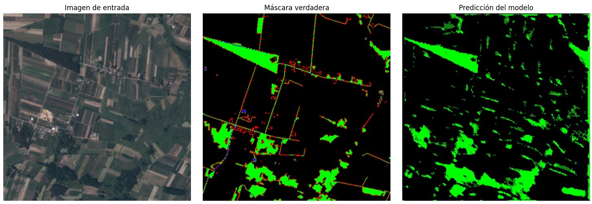

# Inteia Prueba Tecnica 2024

El objetivo de este proyecto es generar y consumir un modelo de redes neuronales convolucionales para la segmentación de imágenes de imagenes satelitales de la tierra.

## Requisitos

- Python 3.x
- Pip
- Virtualenv
- Jupyter Notebook

## Instalación

1. Clona el repositorio: `git clone https://github.com/EndymionK/INTEIA-PruebaTecnica-2024 `
2. Crea un entorno virtual: `virtualenv venv`
3. Activa el entorno virtual: `source venv/bin/activate`
4. Instala las dependencias: `pip install -r requirements.txt`

## Estrucutra del proyecto

- `scripts/`: Contiene los scripts de Python para el analisis exploratorio de datos y la creación del modelo de redes neuronales.
- `     EDA/`: Contiene un script para el analisis exploratorio de datos.
- `     Model/`: Contiene un script para la creación del modelo de redes neuronales.
- `alternativo/`: Contiene un script alternativo para consumir un modelo entrenado en roboflow y realiza la segmentación de las 10 primeras imagenes del dataset. (Enlace al modelo: https://app.roboflow.com/inteia-jrutn/corine-land-cover-segmentation)
- `     Predicciones/`: Contiene las predicciones del modelo entrenado en roboflow.
- `RGB/`: Carpeta que contiene las imagenes RGB del dataset.(No incluida en el repositorio)
- `README.md`: Instrucciones para reproducir el proyecto.
- `requirements.txt`: Archivo con las dependencias del proyecto.

- Versión en colab: https://colab.research.google.com/drive/12mzEaEZk81atPd2dLnjZ_6iE3tVyH11R?usp=sharing

## Analisis Exploratorio de Datos

- Se realizo un analisis exploratorio de datos para visualizar las imagenes del dataset y las mascaras de segmentación.
- Se observó que las imagenes RGB y las mascaras de segmentación tienen mismas dimensiones.
- Se observó que las mascaras de segmentación tienen 5 clases: 0, 1, 2, 3, 4.
- Se observó que las clases 0, 1, 2, 3, 4 representan posiblemente los siguientes tipos de cobertura de tierra:
    - 0: Áreas sin vegetación
    - 1: Edificaciones
    - 2: Vegetación
    - 3: Agua
    - 4: Caminos
- Se observó que las clases 0, 1, 2, 3, 4 estan muy desbalanceadas en el dataset.
- Se encontró que las clases tienen los siguientes porcentajes promedios de presencia:  
    - 0: 50.33%
    - 1: 7.13%
    - 2: 34.69%
    - 3: 7.48%
    - 4: 0.34%
- Se implementó una grafica de pastel para visualizar el desbalance de las clases.

## Preprocesamiento de Datos

- Se realizo un preprocesamiento de datos para normalizar las imagenes RGB y las mascaras de segmentación.
- Se reescaló las imagenes RGB y las mascaras de segmentación a un tamaño de 256x256 por cuestiones de memoria.
- Se realizo un preprocesamiento de datos para convertir las mascaras de segmentación a un formato de one-hot encoding.
- Se realizo un preprocesamiento de datos para dividir el dataset en un conjunto de entrenamiento y un conjunto de validación.
- Se realizo un preprocesamiento de datos para crear un generador de datos para el entrenamiento del modelo de redes neuronales (Disponible solo en el Colab, sin mucha diferencia en el rendimiento del modelo).

## Construcción del Modelo

- Se construyó un modelo de redes neuronales convolucionales U-Net para la segmentación de imagenes.
- Se utilizó una función de pérdida personalizada para la segmentación de imagenes a partir de focal loss.
- Se utilizó el optimizador Adam.
- Se utilizó la metrica accuracy para evaluar el rendimiento del modelo.

- Se hicieron intentos fallidos de implementar submuestreo y sobremuestreo para balancear las clases del dataset por lo que se decidió no implementarlos.
- Se implementó un balanceo de clases en el modelo de redes neuronales con pesos de clase pero no se observó una mejora significativa en el rendimiento del modelo.
- Se probó con diferentes arquitecturas de redes neuronales convolucionales y se observó que la arquitectura U-Net tiene un mejor rendimiento en la segmentación de imagenes.
- Se probó con diferentes funciones de pérdida y se observó que la focal loss tiene un mejor rendimiento en este caso.

## Entrenamiento del Modelo

- Se entrenó el modelo de redes neuronales con 5 épocas en local y 100 épocas en el Colab.
- Descubrí 20 nuevos errores en visual studio code y 7 formas diferentes de crashear mi PC :C 

## Rendimento del Modelo

- En los mejores casos, el modelo obtuvo un f1_score de 0.43.
- La metrica IoU tuvo un rendimiento similar al f1_score.
- La accuracy tuvo un rendimiento promedio de 0.48.
- Se observó que el modelo tiene un rendimiento bajo en la segmentación de imagenes.
- Se observó que el modelo tiene un rendimiento bajo en la segmentación de las clases 1, 3, 4.
- Se observó que el modelo tiene un rendimiento aceptable en la segmentación de las clases 0, 2.
- El modelo en la mayoría de los casos se limita a segmentar las clases 0 y 2 ignorando las clases 1, 3, 4.

## Conclusiones

- La implementación de un modelo de redes neuronales convolucionales para la segmentación semantica multiclase de imagenes de imagenes satelitales de la tierra es un problema complejo pero muy interesante.
- El desbalanceo de clases y la reducción de la resolución de las imagenes son factores que afectan gravemente el rendimiento del modelo.
- La focal loss es una función de pérdida que puede mejorar el rendimiento del modelo en la segmentación de imagenes.
- Vale la pena analizar el paper (https://www.mdpi.com/2072-4292/14/18/4558) para implementar la arquitectura sugerida.
- La web Roboflow es una excelente herramienta para la clasificación y segmentación de imagenes ademas de la creación de modelos de redes neuronales. (Gracias por enseñarmela c: )

## Areas de Mejora

- Al tener las imagenes una resolución tan alta, sería buena idea dividir las imagenes en parches para reducir la resolución en vez de reescalarlas. Esto mejoraría el rendimiento del modelo y no se perdería tanta información.
- Un dataset más grande y balanceado podría mejorar el rendimiento del modelo.
- Contar con más poder computacional para entrenar el modelo con más épocas y con un tamaño de batch e imagenes más grandes. (Azure Machine Learning o Google Cloud Platform)
- Implementar submuestreo y sobremuestreo para balancear las clases del dataset.
- Implementar un balanceo de clases en el modelo de redes neuronales con pesos de clase.
- Implementar una arquitectura de redes neuronales convolucionales más avanzada.

## Plus

- Se implementó un script alternativo para consumir un modelo entrenado en roboflow y realizar la segmentación de las 10 primeras imagenes del dataset.
- Para este modelo se utilizó un dataset encontrado en roboflow (https://universe.roboflow.com/carlos-lvaro/landuse-hlcwh).
- Se crearon 3 versiones del modelo con diferentes preprocesamientos de datos.
- El modelo con el mejor rendimiento obtuvo un mIoU de 61.3% (https://app.roboflow.com/inteia-jrutn/corine-land-cover-segmentation/4)
- Al probarlo con las imagenes del dataset, el modelo da unos resultados... interesantes. Igualmente, se puede mejorar con un dataset más grande y balanceado
- Se identificaron distintos datasets que podrían ser consolidados para mejorar el modelo.
    - Mining dump: https://universe.roboflow.com/tailings-wdzgw/mining-dumps
    - Coastal wetland: https://universe.roboflow.com/cosatl-wetland/new-coastal-wetland-segmentation
    - Inland water bodies: https://universe.roboflow.com/inland-water-bodies/new-inland-water-bodies-segmentation
    - Etc.

## Agradecimientos

- Agradezco a Inteia por darme la oportunidad de realizar esta prueba técnica, fue un reto muy interesante y aprendí mucho en el proceso. ❤️

